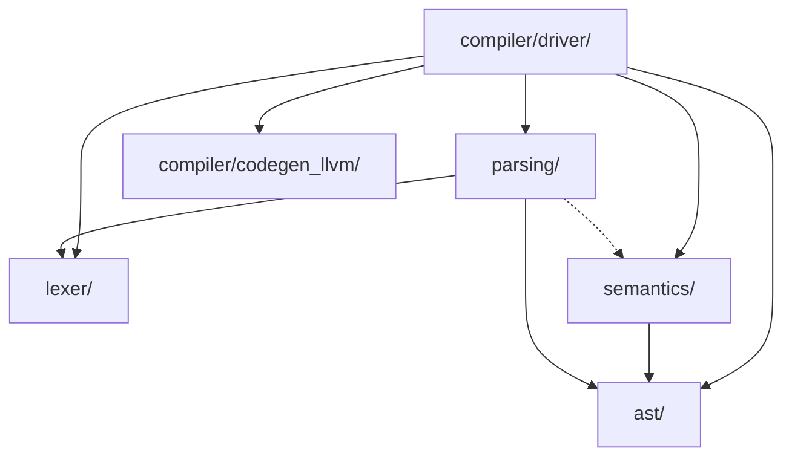

# Архитектура компилятора C'

Модули компилятора:

- **source/** &mdash; чтение и хранение исходного кода, а также ссылок на него.
- **diagnostics/** &mdash; обработка диагностических сообщений.
- **ast/** &mdash; представление кода C' внутри компилятора с помощью AST.
- **lexer/** &mdash; лексический анализ.
- **parsing/** &mdash; синтаксический анализ.
- **semantics/** &mdash; семантический анализ.
- **compiler/codegen_llvm/** &mdash; кодогенерация машинного кода с помощью LLVM.
- **compiler/driver/** &mdash; драйвер компилятора C'.

## О возможной зависимости parsing/ от semantics/

Для разрешения неоднозначностей синтаксиса C' требуется семантическая информация. Возможно появление зависимостей между модулями синтаксического разбора и семантического анализа.
